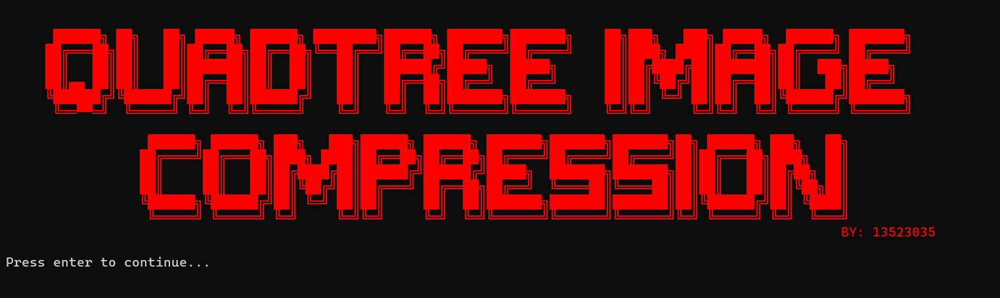

  
</br>

<H3 align="center"> Algoritma Divide and Conquer  : Tugas Kecil 2 IF2211 Strategi Algoritma </p>

</br>
</br>

##  Contributors

<div align="center">

<table border="1" cellspacing="0" cellpadding="8"> 
  <tr> <th>NIM</th> <th>Nama</th> </tr> 
  <tr> <td>13523035</td> <td>M. Rayhan Farrukh</td> </tr> 
  </tr> </table>
</div>

  

##  About

<h3 align="center"> Image Compression Using Quadtree </h3>

<div align="center">
  
  
</div>
</br>
</br>
This program is an image compression algorithm using Quadtree's divide and conquer to efficiently and optimally reduce file size, while maintaining important details. 
</br>
</br>
The user can input an image file, along with compression parameters (target, threshold, minimal block size), and can save the compressed images and a gif file showing the proccess of the compression.

</br>

<div align="center" style="margin-bottom: 50px;">
  
  
  
</div>
<div align="center">
  
  
</div>

 <h3>Features</h3>

 - Image compression using 5 different error calculation methods (using ```stb_image.h```)
 - Save the solution as image and gif file (using ```gif.h```)
 - Supports png, jpg and jpeg

<h3> Requirements <h3>

- C++17


##  How to use
<h3>Installation</h3>
Clone the repository

```sh
    git clone git@github.com:grwna/Tucil2-13523035.git
```
<p align="center">or</p>

```sh
   git clone https://github.com/grwna/Tucil2-13523035.git
```
 then, navigate to the repository folder
 
 <h3>Compilation and Running</h3>
 
Compile the program using ```make build``` and then run program using ```make run```.

Alternatively, you can do both at once using ```make all```.

##  File Structure

- ```bin``` contains compiled bytecodes of the program
- ```doc``` contains all kinds of documentation for the project
- ```src``` contains source code of the program
- ```test``` holds the outcome of the program for test cases

